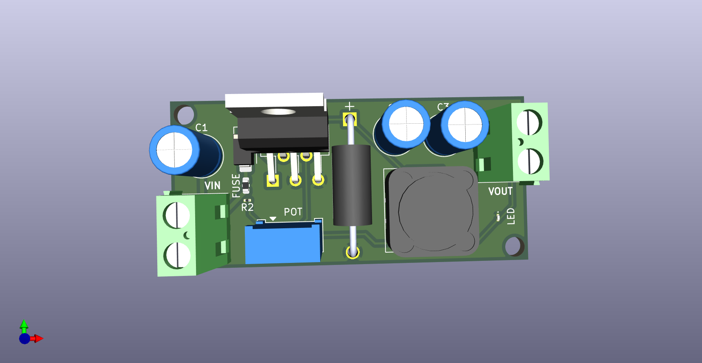
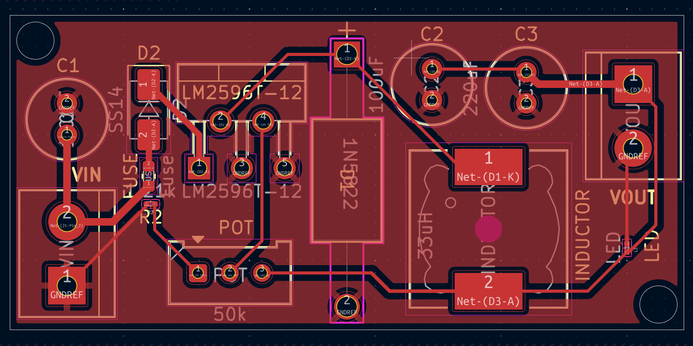
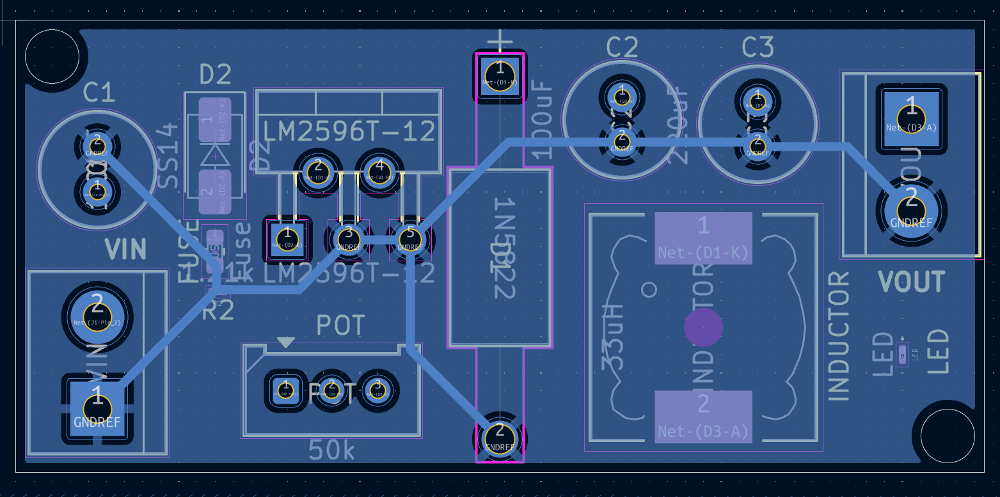

# DC-DC_BUCK-CONVERTER-PCB
DC-DC BUCK CONVERTER using **LM2596T-12**. Designed in **KiCad**.

---

## 📌 Overview
This project implements a **DC-DC BUCK CONVERTER** based on the **LM2596T-12** regulator.  
It is designed in **KiCad** with the following specifications:  
- Input Voltage: 12–36 V DC  
- Output Voltage: 12 V DC, 1 A  
- Input protection: 1 A fuse, SS14 Schottky diode (reverse polarity protection)  
- Output indicators: LED with series resistor  
- Capacitors: Electrolytic + ceramic for filtering  
- Adjustable output via trim-pot for fine voltage tuning  

---

## 📂 Repository Structure
- `Source_files_DC-DC_Buck-Converter/Schematics/` → KiCad schematic files (`.kicad_sch`, `.kicad_pro`)  
- `ource_files_DC-DC_Buck-Converter/Schematics/PCB/` → PCB layout file (`.kicad_pcb`)  
  

---

## 📷 Design Media

### 🔹3D-Model

### 🔹Front-CU View

### 🔹Back-CU View

---

## 🛠 Tools Used
- **KiCad 9** → Schematic & PCB design  
- **GitHub** → Version control & project hosting  

---

DUNNA MANIKANTA  
bt22ece104@iiitn.ac.in
